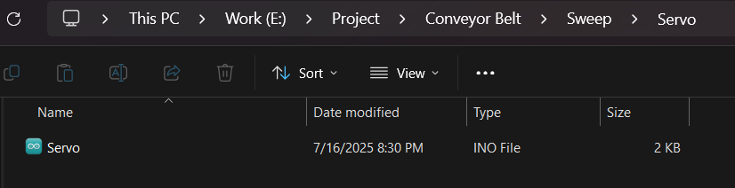
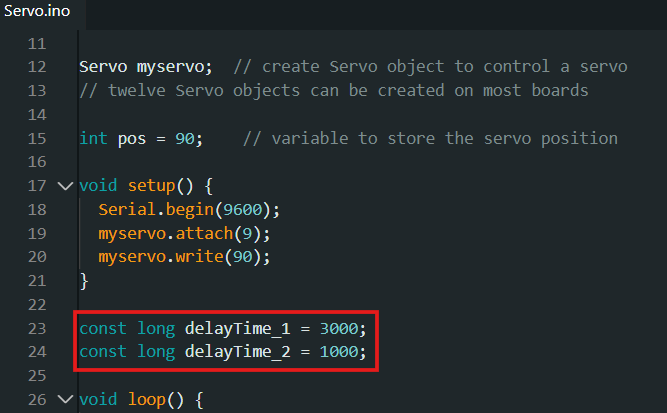
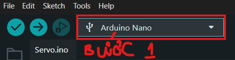
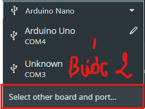
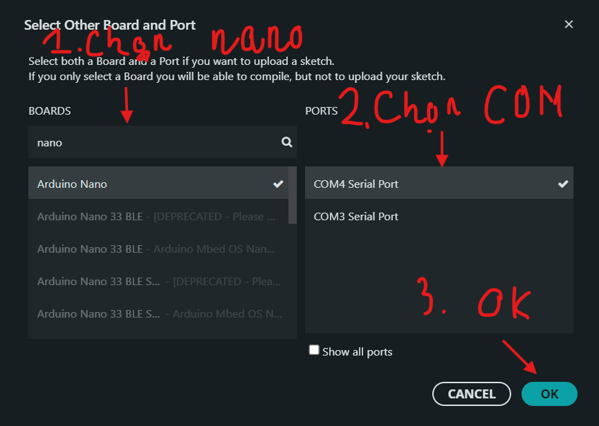
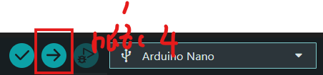
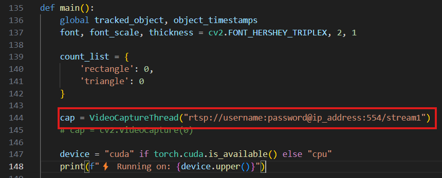

# Classification Object in Conveyor Belt

## Giới thiệu:

- Đây là project về ứng dụng IoT kết hợp với AI để phát hiện và phân loại sản phẩm dựa trên hình dạng **(tam giác - hình vuông)**. Sử dụng model **YOLO** để phân loại thông qua **Camera IP** và sử dụng **Servo** để đẩy sản phẩm.

## Yêu cầu:
- Sử dụng GPU
- Cài đặt [CUDA version 11.8](https://developer.nvidia.com/cuda-11-8-0-download-archive?target_os=Windows&target_arch=x86_64)

- Cài đặt TP-Link Tapo
- Laptop và Camera phải chung Wifi
* **Lưu ý**: Wifi không được chặn (Wifi FPTU sẽ chặn không cho camera kết nối, cần phải kết nối thông qua 4G hoặc Wifi riêng)

## Video hướng dẫn:
[Google Drive - Hướng dẫn chi tiết](https://drive.google.com/drive/folders/1yxKsXGKaoJk8VRQk04IYU0DpA0V7p8SK?usp=sharing)

## Cài đặt:
### Bước 1: Clone Repository
```
git clone git@github.com:pikamanh/Classification-In-Conveyor-Belt.git
```

### Bước 2: Cài đặt môi trường ảo (Virtual Environment)
- Mở terminal trong **VS Code** (nếu sử dụng PyCharm thì xem hướng dẫn trên mạng)
```
py -m venv venv
```

### Bước 3: Cài đặt Library
- Truy cập vào venv:
```
.\venv\Scripts\activate
```
- cài đặt thông qua `requirements.txt`
```
pip install -r .\requirements.txt
```

## Hướng dẫn sử dụng:
### Chỉnh thời gian cho Servo (nếu cần):
- Nếu muốn chỉnh thời gian quay của servo thì cần cài thêm `Arduino IDE`. Thực hiện các bước như hình ảnh sau (nếu không cần có thể bỏ qua):
#### Bước 1: mở file `Servo.ino` bằng `Arduino IDE` theo đường dẫn sau:
```
Sweep\Servo\Servo.ino
```

#### Bước 2: Thay đổi thời gian quay trái và phải dựa trên 2 biến `delayTime_1` **(Đẩy hình vuông)** và `delayTime_2` **(Đẩy tam giác)**:

#### Bước 3: Chọn **COM** đúng với cổng cắm USB kết nối với Arduino. Sau đó nhấn **mũi tên Upload**:
##### Bước 1:

##### Bước 2:
    
##### Bước 3:

##### Bước 4:

    
### Cài đặt Camera:
- Có thể xem trên web của [NPH Tapo](https://www.tapo.com/vn/faq/51/):

- Video hướng dẫn trong drive
### Băng chuyền:
- Video hướng dẫn trong drive
### Phần mềm:
- Chỉ cần chú ý ở phần:
    - **username:** Tên đăng nhập trong ứng dụng Tapo
    - **ppassword:** Mật khẩu trong ứng dụng Tapo
    - **ip_address:** IP lấy ở phần `thông tin thiết bị` trong ứng dụng Tapo

## Demo:


## Người thực hiện:
- [Nguyễn Mạnh Hưng](https://github.com/pikamanh)
- [Nguyễn Võ Hoàng Khang](https://github.com/khangkaka066)
- [Trần Văn Thuận](https://github.com/trankhacthuan)